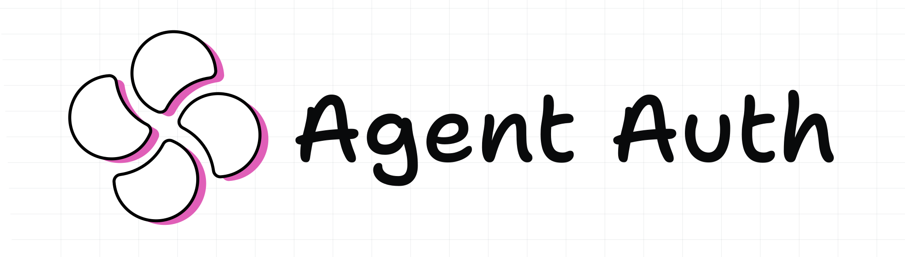

<div align="center">
  <a href="https://cohorte-ai.github.io/agent-auth/">
    <picture>
      <source media="(prefers-color-scheme: dark)" srcset=".github/images/TheAIOS-Agent-Auth-darkmode.svg">
      <source media="(prefers-color-scheme: light)" srcset=".github/images/TheAIOS-Agent-Auth.svg">
      
    </picture>
  </a>
</div>

<p align="center"><strong>Agent-specific identity and access management for AI agents.</strong></p>

<p align="center">
  <a href="https://pypi.org/project/theaios-agent-auth/"></a>
  <a href="https://pypi.org/project/theaios-agent-auth/"></a>
  <a href="https://github.com/Cohorte-ai/agent-auth/actions"></a>
  <a href="https://cohorte-ai.github.io/agent-auth/"></a>
  <a href="https://github.com/Cohorte-ai/agent-auth/blob/main/LICENSE"></a>
</p>

---

## What does it do?

When AI agents operate in your enterprise, the authorization question changes from *"Can this user do X?"* to:

> **"Can this agent, acting on behalf of this user, do X, right now, on this resource?"**

`agent-auth` answers that question. It is a lightweight, YAML-driven authorization engine purpose-built for AI agent systems. No cloud dependency. No vendor lock-in. Just a Python library and a CLI.

---

## Features

- **Roles with inheritance** — define hierarchical permission sets via `extends`
- **Agent profiles** — assign roles, allow/deny specific actions, scope to resource patterns
- **Three-tier approval** — autonomous / soft / strong
- **Sessions** — time-limited, scope-bound authorization contexts (UUID4 IDs)
- **Delegation** — temporary permission grants from users to agents
- **Agent-to-agent (A2A)** — control which agents can invoke which
- **Audit logging** — every decision recorded in JSONL
- **Safe expression language** — custom DSL for policy conditions (no `eval()`)
- **CLI** — validate, check, manage sessions and delegations from the terminal

---

## Quick Start

### Install

```bash
pip install theaios-agent-auth
```

### Define your policy (`agent_auth.yaml`)

```yaml
version: "1.0"

roles:
  viewer:
    actions: [read]
  editor:
    extends: viewer
    actions: [write]

profiles:
  assistant:
    role: editor
    scopes: []

approval_policies:
  - name: destructive
    condition: 'action == "delete"'
    tier: strong
```

### Use in Python

```python
from theaios.agent_auth.config import load_config
from theaios.agent_auth.engine import AuthEngine
from theaios.agent_auth.types import AuthRequest

config = load_config("agent_auth.yaml")
engine = AuthEngine(config)

decision = engine.authorize(AuthRequest(
    agent="assistant",
    user="alice",
    action="read",
))

print(decision.allowed)        # True
print(decision.is_autonomous)  # True
print(decision.is_denied)      # False
```

### Use the CLI

```bash
# Validate your config
agent-auth -c agent_auth.yaml validate

# Check a permission
agent-auth -c agent_auth.yaml check --agent assistant --user alice --action read

# Create a session
agent-auth -c agent_auth.yaml sessions --create --agent assistant --user alice --scope "project:*"

# Delegate permissions
agent-auth -c agent_auth.yaml delegate --from-user alice --to-agent assistant --actions deploy --duration 3600
```

---

## Why this library?

| Approach | Limitation |
|---|---|
| **Okta / Azure AD** | Built for human users, not AI agents. No concept of approval tiers, agent scopes, or A2A authorization. |
| **OPA / Cedar** | General-purpose policy engines. Powerful but require significant effort to model agent-specific patterns (sessions, delegation, A2A). |
| **Custom code** | Every team reinvents the same patterns. No standard, no audit trail, no CLI tooling. |
| **`agent-auth`** | Purpose-built for AI agents. YAML config, three-tier approval, sessions, delegation, A2A, audit — all out of the box. Safe expression language — no `eval()`. |

---

## Documentation

Full documentation: [cohorte-ai.github.io/agent-auth](https://cohorte-ai.github.io/agent-auth/)

| Topic | Link |
|---|---|
| Concepts | [concepts](https://cohorte-ai.github.io/agent-auth/concepts/) |
| Config syntax | [config-syntax](https://cohorte-ai.github.io/agent-auth/config-syntax/) |
| CLI reference | [cli](https://cohorte-ai.github.io/agent-auth/cli/) |
| API reference | [api-reference](https://cohorte-ai.github.io/agent-auth/api-reference/) |
| Integration | [integration](https://cohorte-ai.github.io/agent-auth/integration/) |

---

## Ecosystem

`agent-auth` is part of the [theaios](https://theaios.xyz) platform — modular tech bricks for enterprise AI systems:

| Package | Purpose |
|---|---|
| [theaios-guardrails](https://github.com/Cohorte-ai/guardrails) | Input/output guardrails (TrustGate) |
| [theaios-context-router](https://github.com/Cohorte-ai/context-router) | Intelligent context routing |
| [theaios-agent-monitor](https://github.com/Cohorte-ai/agent-monitor) | Runtime observability |
| **theaios-agent-auth** | **Identity and access management** |

---

## License

Apache 2.0 — see [LICENSE](LICENSE).
